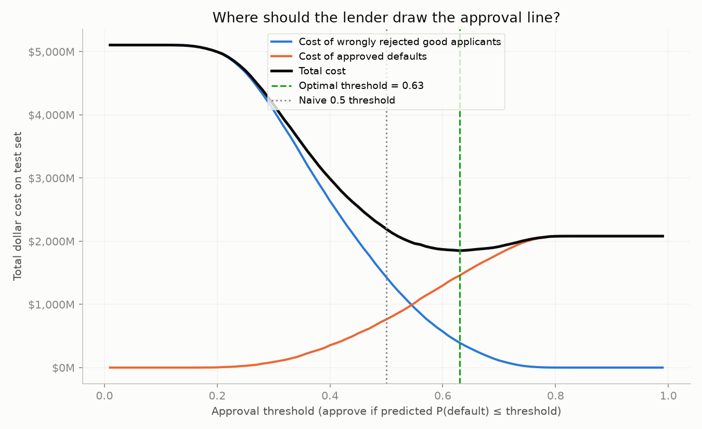
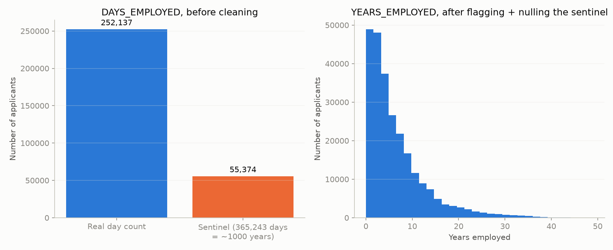
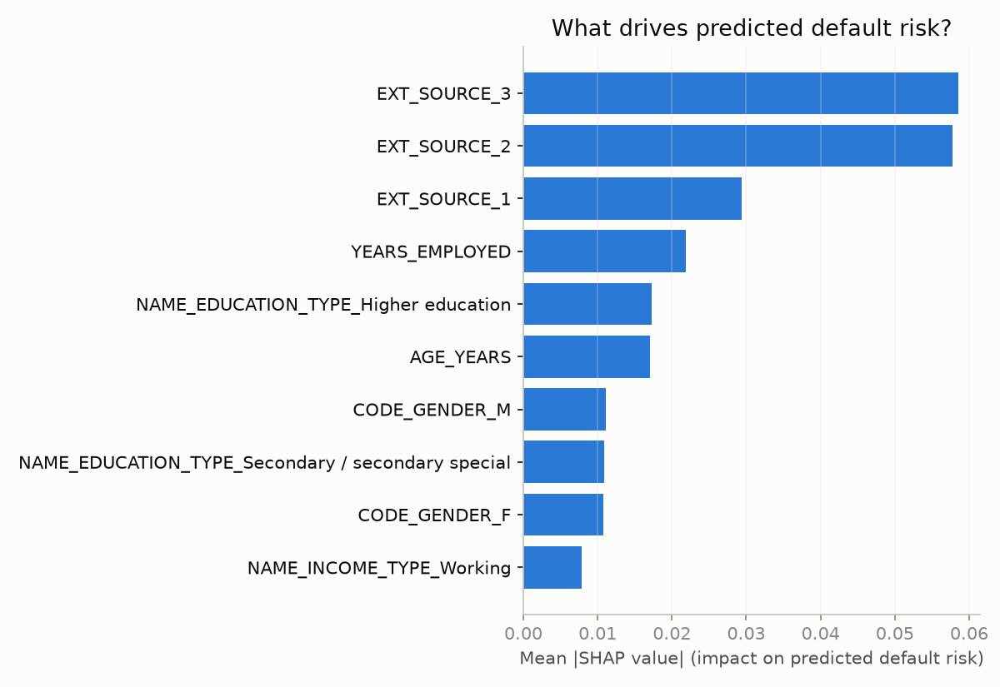

# Where Should a Lender Draw the Approval Line?



A credit default model outputs a probability. It does not output a decision.
Somebody still has to pick the cutoff that turns a 9% chance of default into
"approve" or "decline," and most portfolio projects skip that step entirely,
defaulting to 0.5 because that's what `.predict()` uses internally. This
project treats the **threshold**, not the model, as the thing worth
optimizing. It prices both ways a lending decision can go wrong in real
dollars, sweeps the cutoff across its full range, and shows exactly where the
total cost is minimized, then explains individual decisions in plain English
using SHAP.

## The problem

"I trained a model and got 0.74 AUC" proves you can call `.fit()`. It doesn't
prove you understand that someone still has to act on that probability. A
non-technical stakeholder (a VP of Risk, a compliance reviewer, the applicant
themselves) doesn't care about AUC. They care about how many dollars a given
cutoff costs the business, and whether they can explain any single decision
without a statistics background. This project is built around answering both
of those, not around squeezing out extra accuracy.

## The data

This project uses the [Home Credit Default Risk](https://www.kaggle.com/c/home-credit-default-risk)
dataset from Kaggle, `application_train.csv`: a real, messy loan application
dataset with 307,511 rows and a well-known set of data quirks. It was chosen
over Lending Club because it's more commonly benchmarked, so there's prior
art to sanity check results against.

**Limitations of the data, stated plainly:**
- This is a single table. It excludes bureau history, previous applications,
  and other joinable context that would likely materially change both the
  AUC and the shape of the cost curve.
- Several features are heavily missing for real applicants; `EXT_SOURCE_1`,
  one of the strongest predictors, is missing for over half of all rows.
  Missing values are imputed, but imputation can only do so much.

## The approach, and why

1. **Clean deliberately, don't just impute and move on.** The dataset
   encodes "not currently employed" as the literal value `365243` in
   `DAYS_EMPLOYED`, about 1,000 years of tenure, instead of a missing value.
   55,374 of 307,511 applicants (18%) carry this sentinel. Handling it
   explicitly (flag it, then null it before any numeric use) demonstrates
   real data cleaning judgment, not just a `.fillna()` call. Imputation for
   other missing values is fit on the training split only; fitting on the
   full dataset first would leak test set distribution into training.

   

2. **Use a model that's good enough, not maximal.** A `RandomForestClassifier`
   with `class_weight="balanced"` (defaults are a small minority of
   applicants, about 8%, so an unweighted model just learns to predict "no
   default" for everyone and looks falsely accurate). RandomForest was
   chosen specifically because SHAP's `TreeExplainer` supports it cleanly
   across library versions; model choice is deliberately not the
   differentiator here.
3. **Treat the threshold as the deliverable.** Sweep the approval threshold
   from 0.01 to 0.99. At each point, sum the dollar cost of both error types
   (below) on the test set. Plot both cost curves and their sum; the minimum
   is the recommended threshold.
4. **Explain decisions, not just accuracy.** SHAP values off the trained
   model: a global ranking of what drives risk overall, and a specific
   declined applicant's top factors translated into a paragraph a
   non-technical manager could read without a legend.

### Cost assumptions (illustrative, not real underwriting economics)

| Constant | Value | Meaning |
|---|---|---|
| `LOSS_GIVEN_DEFAULT` | 60% of loan amount | Cost when an **approved** applicant defaults |
| `EXPECTED_MARGIN` | 12% of loan amount | Forgone profit when a **good** applicant is wrongly declined |

Both live at the top of `src/cost_analysis.py`, clearly labeled. They are
reasonable, round, illustrative numbers chosen to make the cost curve's shape
legible. They are **not** a real lender's actual loss given default or
margin figures, and the optimal threshold below is only as meaningful as
these two assumptions. Change them and the optimal threshold moves; that
sensitivity is the point, not a flaw.

## What we found (and its limitations)

On the full 307,511 row dataset, with a fixed random seed throughout:

- **Baseline model:** ROC AUC = **0.739** on a held out, stratified test
  split, comfortably above a random baseline, using only the single
  `application` table.
- **Optimal threshold: 0.63**, clearly apart from the naive 0.5 cutoff.
  - Total cost at the optimal threshold: **$1,849,876,999**
  - Total cost at the naive 0.5 threshold: **$2,192,470,526**
  - Total cost approving every applicant: **$2,080,401,335**
  - **Savings vs. naive 0.5: about $343M. Savings vs. approving everyone:
    about $231M** (on this test set, under the cost assumptions above).
  - Worth sitting with: at the naive 0.5 cutoff, total cost is *higher* than
    just approving every single applicant. Defaulting to 0.5 wouldn't just
    be a suboptimal decision here, it would actively lose more money than
    doing nothing. That's the entire argument of this project in one number.
- **Global SHAP ranking**, top 3 drivers of predicted risk: `EXT_SOURCE_3`,
  `EXT_SOURCE_2`, `EXT_SOURCE_1`, the three external bureau scores, which is
  consistent with what's widely reported elsewhere for this dataset.

  

- **Local explanation**, one declined applicant: *"Applicant 407400 was
  predicted to have an 82% chance of default and would be declined under
  this model. Factors that pushed their risk score up: a second external
  credit bureau score that is low for this applicant pool (0.02 vs. a
  typical 0.57), a third external credit bureau score that is low for this
  applicant pool (0.05 vs. a typical 0.54) ... Factors that pushed their
  risk score down (worked in their favor): a family status of "Married",
  not having a property ownership of "Y" ..."*

**Limitations of the results:**
- The model is not tuned for maximum AUC on purpose (see Non-goals in
  `PRD.md`); a gradient boosted model or a richer, joined feature set would
  very likely score higher.
- SHAP explanations were generated and verified to run against the actually
  installed `shap` version in this environment (`0.52.0`); the shape
  normalization in `explain.py` was written against the documented
  `TreeExplainer` API and validated against real output, not assumed.
- The cost totals above are only as meaningful as the `LOSS_GIVEN_DEFAULT`
  and `EXPECTED_MARGIN` assumptions in the table above. A different lender,
  with different unit economics, would get a different optimal threshold
  from the same model.

## How to reproduce

```bash
git clone <this-repo>
cd credit-risk-threshold-optimizer
python -m venv .venv && source .venv/bin/activate   # Python 3.11-3.13 recommended
pip install -r requirements.txt

python src/data_prep.py      # builds/refreshes the bundled sample dataset
python src/model.py          # trains the baseline model, prints AUC + classification report
python src/cost_analysis.py  # runs the threshold sweep, prints $ results
python src/explain.py        # prints global SHAP ranking + local explanation
```

`load_raw_data()` in `src/data_prep.py` looks for
`data/raw/application_train.csv` and uses it automatically when present;
that's the file the numbers and charts above come from. That file is too
large to commit to the repo, so `notebooks/analysis.ipynb` narrates the same
walkthrough end to end against the smaller bundled `data/sample.csv`
instead, with its own output baked in; its numbers will differ from the
ones above for that reason.

## Repo layout

```
credit-risk-threshold-optimizer/
├── README.md
├── PRD.md                  # source-of-truth scope doc for this project
├── requirements.txt
├── data/
│   ├── raw/                 # application_train.csv goes here (gitignored)
│   └── sample.csv            # small bundled dataset, committed
├── src/
│   ├── data_prep.py          # data generation, loading, cleaning
│   ├── model.py               # train/test split, imputation, RandomForest baseline
│   ├── cost_analysis.py       # threshold sweep, cost curve plot
│   └── explain.py             # SHAP global + local explanations
├── notebooks/
│   └── analysis.ipynb        # narrated, fully-executed walkthrough
└── outputs/figures/
    ├── cost_curve_real_data.png       # the centerpiece: $ cost vs. threshold
    ├── days_employed_anomaly_real_data.png  # the DAYS_EMPLOYED sentinel, before/after cleaning
    └── shap_importance_real_data.png  # global SHAP feature ranking
```
