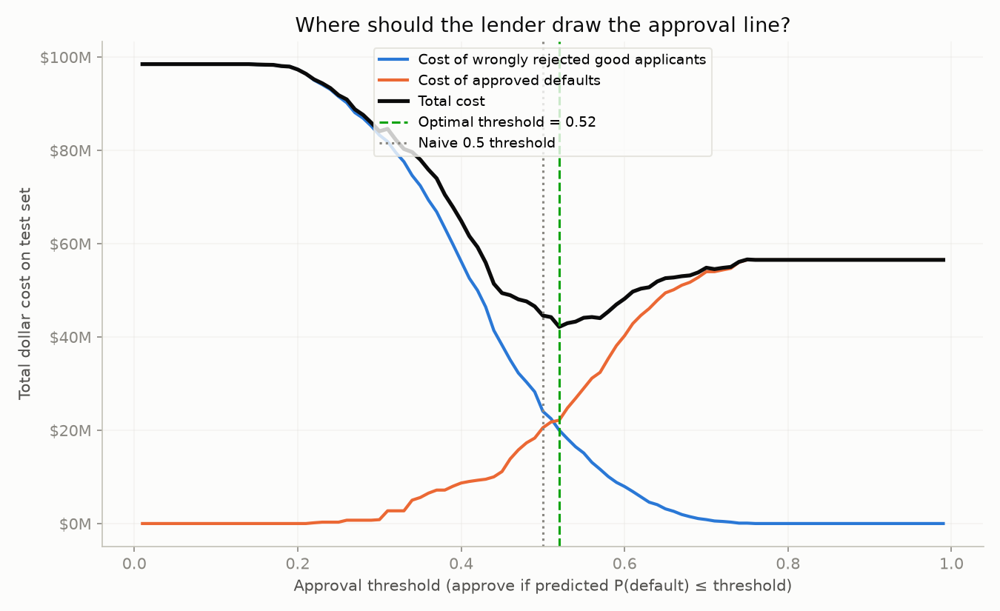
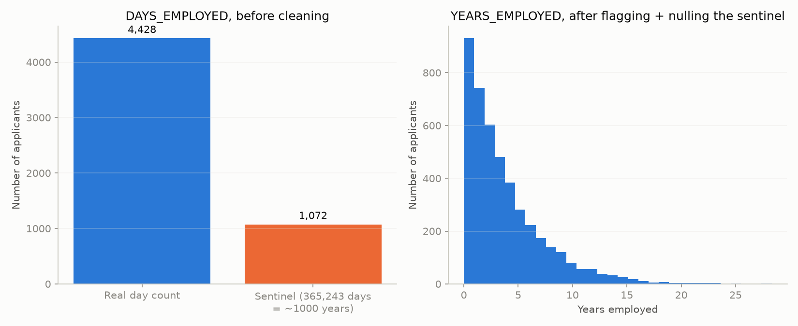
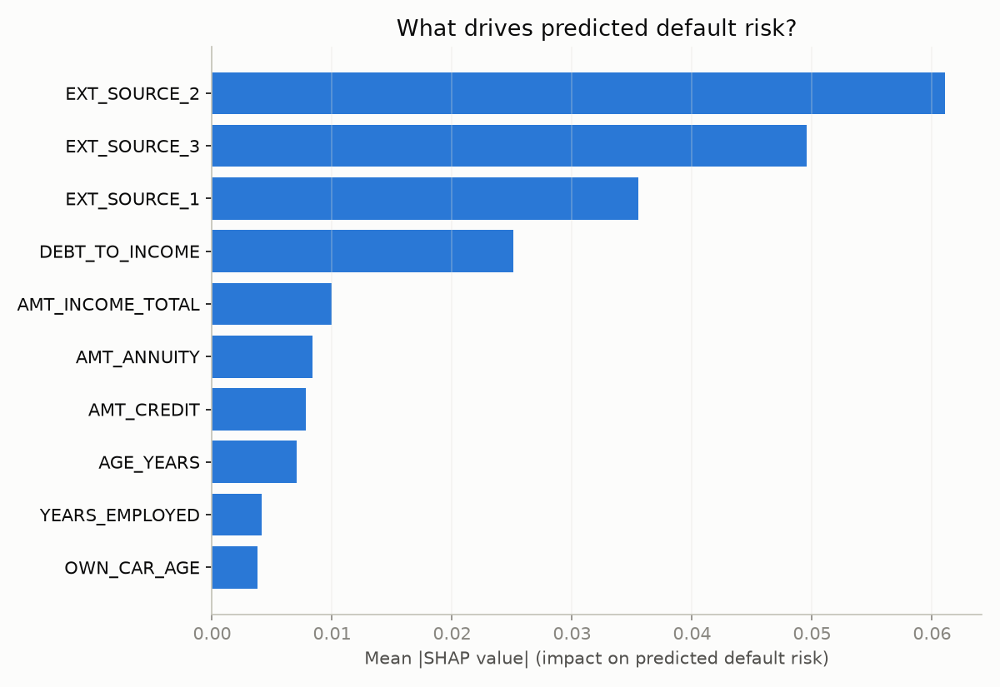

# Where Should a Lender Draw the Approval Line?



A credit-default model outputs a probability. It does not output a decision.
Somebody still has to pick the cutoff that turns "9% chance of default" into
"approve" or "decline" -- and most portfolio projects skip that step entirely,
defaulting to 0.5 because that's what `.predict()` uses internally. This
project treats the **threshold**, not the model, as the thing worth
optimizing: it prices both ways a lending decision can go wrong in real
dollars, sweeps the cutoff across its full range, and shows exactly where the
total cost is minimized -- then explains individual decisions in plain
English via SHAP.

## The problem

"I trained a model and got 0.74 AUC" proves you can call `.fit()`. It doesn't
prove you understand that someone still has to act on that probability. A
non-technical stakeholder (a VP of Risk, a compliance reviewer, the applicant
themselves) doesn't care about AUC -- they care about how many dollars a
given cutoff costs the business, and whether they can explain any single
decision without a statistics background. This project is built around
answering both of those, not around squeezing out extra accuracy.

## The data

**Primary dataset:** [Home Credit Default Risk](https://www.kaggle.com/c/home-credit-default-risk)
(Kaggle), `application_train.csv` -- a single-table subset of a larger,
real, messy loan-application dataset with ~300k rows and a well-known set of
data quirks. Chosen over Lending Club because it's more commonly benchmarked,
so there's prior art to sanity-check results against.

**This repo's default run uses a bundled synthetic sample** (`data/sample.csv`,
5,500 rows), not the real file, so the whole pipeline runs with zero setup and
no Kaggle account. The synthetic data is built to mimic the real dataset's
known structure rather than being random noise:

- ~9% default rate, matching the real dataset's actual base rate.
- `EXT_SOURCE_1/2/3` (external bureau scores) are the strongest predictors of
  default, same as in the real data -- the synthetic target is a function of
  these three plus a debt-to-income term and noise.
- The real dataset's `DAYS_EMPLOYED` sentinel-value anomaly is reproduced
  deliberately (see below).
- `EXT_SOURCE_1` is 50%+ missing and `OWN_CAR_AGE` is missing whenever the
  applicant doesn't own a car, matching the real data's missingness pattern.

**Limitations of the data, stated plainly:**
- The synthetic sample is a stand-in, not the real thing. Real applicant
  behavior has correlations and edge cases no generator captures. Treat every
  number in this README as "what the pipeline produces on the bundled
  sample," not as a claim about real-world credit risk.
- Even the real dataset is a single table. It excludes bureau history,
  previous applications, and other joinable context that would likely
  materially change both the AUC and the shape of the cost curve.

## The approach, and why

1. **Clean deliberately, don't just impute and move on.** The real Home
   Credit dataset encodes "not currently employed" as the literal value
   `365243` in `DAYS_EMPLOYED` -- about 1,000 years of tenure -- instead of a
   missing value. Reproducing and then explicitly handling this quirk (flag
   it, then null it before any numeric use) is meant to demonstrate real
   data-cleaning judgment, not just a `.fillna()` call. Imputation for other
   missing values is fit on the training split only -- fitting on the full
   dataset first would leak test-set distribution into training.

   
2. **Use a model that's good enough, not maximal.** A `RandomForestClassifier`
   with `class_weight="balanced"` (defaults are a small minority of
   applicants, so an unweighted model just learns to predict "no default" for
   everyone and looks falsely accurate). RandomForest was chosen specifically
   because SHAP's `TreeExplainer` supports it cleanly across library
   versions -- model choice is deliberately not the differentiator here.
3. **Treat the threshold as the deliverable.** Sweep the approval threshold
   from 0.01 to 0.99. At each point, sum the dollar cost of both error types
   (below) on the test set. Plot both cost curves and their sum; the minimum
   is the recommended threshold.
4. **Explain decisions, not just accuracy.** SHAP values off the trained
   model: a global ranking of what drives risk overall, and a specific
   declined applicant's top factors translated into a paragraph a
   non-technical manager could read without a legend.

### Cost assumptions (illustrative, not real underwriting economics)

| Constant | Value | Meaning |
|---|---|---|
| `LOSS_GIVEN_DEFAULT` | 60% of loan amount | Cost when an **approved** applicant defaults |
| `EXPECTED_MARGIN` | 12% of loan amount | Forgone profit when a **good** applicant is wrongly declined |

Both live at the top of `src/cost_analysis.py`, clearly labeled. They are
reasonable, round, illustrative numbers chosen to make the cost curve's shape
legible -- they are **not** a real lender's actual loss-given-default or
margin figures, and the optimal threshold below is only as meaningful as
these two assumptions. Change them and the optimal threshold moves; that
sensitivity is the point, not a flaw.

## What we found (and its limitations)

On the bundled synthetic sample, with a fixed random seed throughout:

- **Baseline model:** ROC AUC = **0.743** on a held-out, stratified test
  split -- comfortably above a random baseline, using only the single
  `application` table.
- **Optimal threshold: 0.52**, vs. the naive 0.5 cutoff.
  - Total cost at the optimal threshold: **$42,157,848**
  - Total cost at the naive 0.5 threshold: **$44,582,772**
  - Total cost approving every applicant: **$56,520,780**
  - **Savings vs. naive 0.5: ~$2.4M. Savings vs. approving everyone: ~$14.4M**
    (on this test set, under the cost assumptions above).
- **Global SHAP ranking**, top 3 drivers of predicted risk: `EXT_SOURCE_2`,
  `EXT_SOURCE_3`, `EXT_SOURCE_1` -- the three external bureau scores, which
  is exactly what the synthetic data was constructed to reward, and mirrors
  what's reported for the real dataset.

  

- **Local explanation**, one declined applicant (from the notebook): *"Applicant
  103791 was predicted to have a 75% chance of default and would be declined
  under this model. Factors that pushed their risk score up: a second
  external credit bureau score that is low for this applicant pool (0.37 vs.
  a typical 0.63) ... Factors that pushed their risk score down: applicant
  age that is high for this applicant pool (53.74 vs. a typical 45.48) ..."*

**A finding worth calling out rather than glossing over:** the optimal
threshold (0.52) landed *close* to the naive 0.5 cutoff here, not far from
it. That's not the pipeline failing to find a dramatic result -- it's because
`class_weight="balanced"` already pushes the model's predicted probabilities
into a reasonably well-calibrated range, so 0.5 turns out to be a decent
guess in this particular run. The point of this project was never "0.5 is
always wrong" -- it's that nobody could have known it was *this* close to
right without doing the cost-sensitive sweep. On a differently-calibrated
model, or with different cost assumptions, this gap could be far larger, and
the only way to know is to check, not assume.

**Limitations of the results:**
- All numbers above come from the synthetic sample. Re-run against the real
  Kaggle file (see below) before treating any of them as a claim about real
  credit risk.
- SHAP explanations were generated and verified to run against the actually
  installed `shap` version in this environment (`0.52.0`) -- the shape
  normalization in `explain.py` was written against the documented
  `TreeExplainer` API but validated against real output, not assumed.
- The model is not tuned for maximum AUC on purpose (see Non-goals in
  `PRD.md`); a gradient-boosted model or richer joined feature set would very
  likely score higher.

## How to reproduce

```bash
git clone <this-repo>
cd credit-risk-threshold-optimizer
python -m venv .venv && source .venv/bin/activate   # Python 3.11-3.13 recommended
pip install -r requirements.txt
```

### With the bundled synthetic sample (default, no setup)

```bash
python src/data_prep.py      # (re)generates data/sample.csv, saves outputs/figures/days_employed_anomaly.png
python src/model.py          # trains the baseline model, prints AUC + classification report
python src/cost_analysis.py  # runs the threshold sweep, prints $ results, saves outputs/figures/cost_curve.png
python src/explain.py        # prints global SHAP ranking + local explanation, saves outputs/figures/shap_importance.png
```

Or open `notebooks/analysis.ipynb` for the narrated version with everything
already executed and baked in.

### With the real Kaggle data (opt-in upgrade)

1. Create a free [Kaggle](https://www.kaggle.com) account and accept the
   competition rules for [Home Credit Default Risk](https://www.kaggle.com/c/home-credit-default-risk).
2. Download `application_train.csv` and place it at
   `data/raw/application_train.csv` (gitignored -- it's never committed).
3. Re-run any script above, or the notebook, unchanged. `load_raw_data()` in
   `src/data_prep.py` prefers the real file whenever it's present and prints
   which source it used.

## Repo layout

```
credit-risk-threshold-optimizer/
├── README.md
├── PRD.md                  # source-of-truth scope doc for this project
├── requirements.txt
├── data/
│   ├── raw/                 # real Kaggle file goes here (gitignored)
│   └── sample.csv            # synthetic fallback, committed
├── src/
│   ├── data_prep.py          # synthetic data generation, loading, cleaning
│   ├── model.py               # train/test split, imputation, RandomForest baseline
│   ├── cost_analysis.py       # threshold sweep, cost curve plot
│   └── explain.py             # SHAP global + local explanations
├── notebooks/
│   └── analysis.ipynb        # narrated, fully-executed walkthrough
└── outputs/figures/
    ├── cost_curve.png            # the centerpiece: $ cost vs. threshold
    ├── days_employed_anomaly.png # the DAYS_EMPLOYED sentinel, before/after cleaning
    └── shap_importance.png       # global SHAP feature ranking
```
